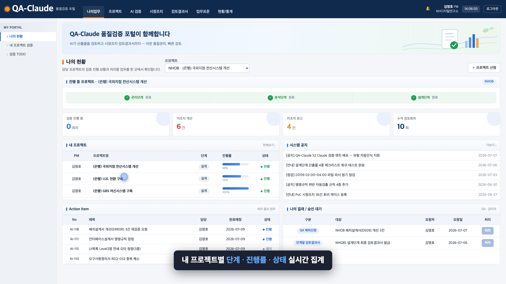
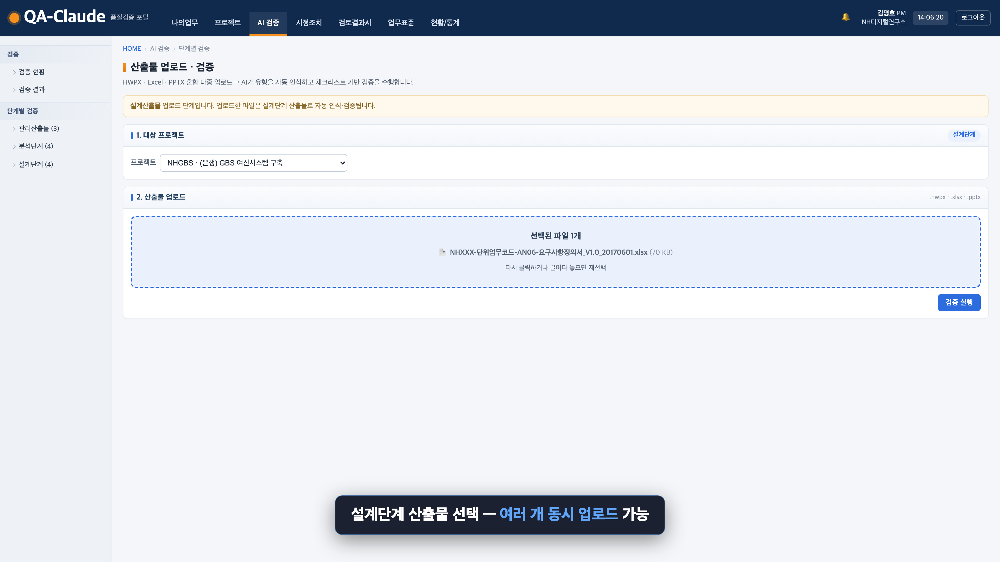
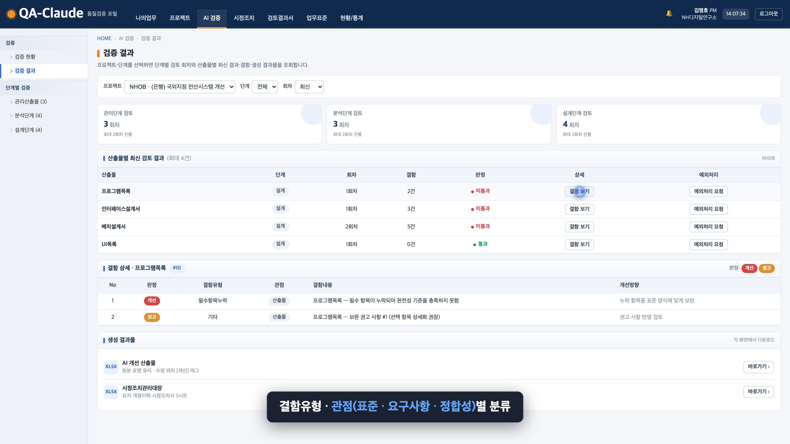
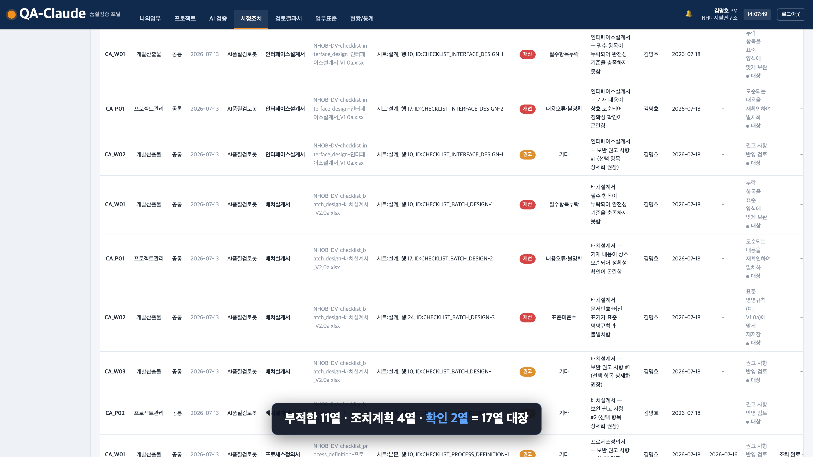

# QA-GPT — AI 기반 IT SI 산출물 자동 품질검토·개선 플랫폼

> **산출물을 업로드하면, 품질검토 결과서 · 개선 원본 · 시정조치관리대장을 자동으로 생성합니다.**

IT SI 프로젝트의 산출물 품질검토를 사람이 수기로 수행하던 과정을 AI로 자동화합니다.
사내 표준 체크리스트를 학습한 AI가 산출물을 전수·즉시 검증하고, 결함을 직접 수정한 개선본과 감리 대응 자료까지 한 번에 만들어 냅니다.

`Java` · `Spring Boot` · `PostgreSQL` · `LLM` · 해커톤 프로젝트 (2026.7)

---

## 🎯 왜 만들었나 — 문제 정의

IT SI 산출물 품질검토는 지금까지 ① 제3자 QA 조직 · ② PMO 검토 · ③ PM 자체 검토에만 의존해 왔습니다. 이 방식에는 구조적 한계가 있습니다.

- **느립니다** — 단계 1개 점검에 최소 **3~4 영업일** (착수 → 완료 → 시정요청 → 결과보고)
- **전수 검토가 불가능합니다** — 인력·비용 제약으로 표본 검토에 그침
- **결함이 연쇄 전염됩니다** — 결함의 70% 이상이 요구사항 단계 누락에서 기인하고, 1개 오류가 여러 산출물로 전파 (예: `Level2명` 오타 하나가 UI목록·메뉴구조도·프로그램목록 3개 산출물로 확산)
- **품질이 PM 역량에 좌우됩니다** — 담당자별 편차가 크고, 결함 발견이 늦어 수정 비용이 기하급수적으로 증가

> **실증 근거:** 실제 프로젝트 「투자자문 관리시스템 구축」(코드 `NBIA`)의 분석·설계 단계에서만 **36건의 시정조치 항목**이 도출되었고, 그중 상당수가 명명규칙·필수항목·정합성 등 **AI로 즉시 검증 가능한 정형 결함**이었습니다.

---

## 💡 해결 — QA-GPT가 하는 일

산출물을 올리면 AI가 사내 표준 체크리스트에 따라 검증하고, **3종 산출물을 자동 생성**합니다.

| 산출물 | 내용 |
|--------|------|
| 📋 **품질검토 결과서** | 체크리스트별 결함 판정 — `[개선]`(필수 수정) / `[권고]`(권장) |
| ✏️ **개선 원본** | 결함을 직접 수정한 산출물 원본 |
| 🗂️ **시정조치관리대장** | 결함 → 조치 이력을 추적하는 감리·검수 대응 자료 |

**단순 알림을 넘어, 결함을 직접 고친 개선본과 문서화된 검토 근거까지 만들어 내는 것**이 QA-GPT의 차별점입니다.

---

## 🖥️ 데모

| 대시보드 | 산출물 업로드 |
|:---:|:---:|
|  |  |
| **품질검토 결과서** | **시정조치관리대장** |
|  |  |

▶️ **[전체 시연 영상 보기](docs/qa-gpt-demo.webm)** · 📊 **[발표자료](docs/presentation.html)**

---

## ⚙️ 동작 방식

```
산출물 업로드
   └─▶ 파싱 (parser)          문서 포맷 인식 — 구 템플릿(2017)/신 포맷(2025) 유연 매핑
   └─▶ 분류 (classifier)      산출물 종류 식별 (관리/분석/설계)
   └─▶ 체크리스트 검증         산출물별 검증 기준 12종 적용
   └─▶ 교차 정합성 검사        산출물 간 연쇄 결함 탐지 (cross-consistency)
   └─▶ 결과 생성 (generator)  결과서 + 개선본 + 시정조치관리대장
```

핵심 파이프라인은 `ReviewOrchestrator`가 조율하며, 검토 진행 상태는 실시간(Phase 그래프)으로 표시됩니다.

---

## 🏗️ 기술 스택

- **백엔드**: Java + Spring Boot (`com.nh.qagpt`)
- **DB**: PostgreSQL
- **프론트**: HTML / CSS / JS (정적 퍼블리싱)
- **AI**: LLM 기반 문서 파싱·판정·개선
- **인프라**: Docker

---

## 🚀 실행 방법

```bash
# 1. 빌드 & 실행
./gradlew bootRun

# 또는 Docker
docker build -t qa-gpt .
docker run -p 8080:8080 qa-gpt
```

실행 후 브라우저에서 `http://localhost:8080` 접속.

```bash
# 테스트 실행
./gradlew test
```

---

## 📚 문서

| 문서 | 내용 |
|------|------|
| [메인 스펙](docs/spec.md) | 제품 정의 · 결함 판정 체계 · 체크리스트 정의 |
| [PRD](docs/prd.md) | 제품 요구사항 정의서 |
| [프론트엔드](docs/frontend.md) | 화면 · 공통모듈 · RBAC · 계정 |
| [체크리스트 12종](docs/checklists/) | 산출물별 검증 기준 |
| [CLAUDE.md](CLAUDE.md) | 프로젝트 규칙 · 문서 지도 |

---

## 📐 프로젝트 규칙

- **판정 어휘**: `[개선]`(=필수 수정) / `[권고]`(=권장)
- **문서번호 체계**: `PM-*` (관리산출물) · `NBIA-DV-*` (개발산출물)
- **git**이 원본(source of truth), **Notion**은 미러

---

<sub>실증 기준: 실제 프로젝트 「2511024_(은행) 투자자문 관리시스템 구축」(코드 `NBIA`)의 QA 품질점검 케이스 가이드 및 시정조치 PoC 데이터에 근거.</sub>
